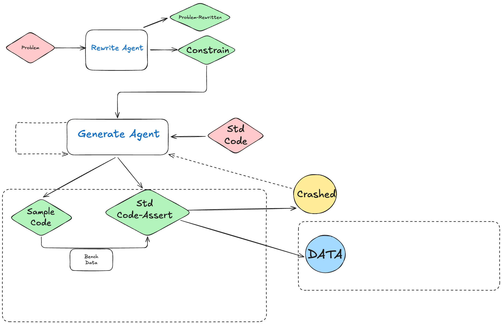

# algogen

`algogen` 是一个多 Agent 自动出题工具：读取题面、改写描述、生成数据、调用模板题解产出标准输出，并打包 zip。



## 安装

```bash
uv sync
```

## 配置

1. 复制配置模板：

```bash
cp .env.example .env
```

2. 至少填写以下变量：

- `DESC_AGENT_MODEL`
- `BENCH_AGENT_MODEL`
- 对应模型提供商 API Key（例如 `OPENAI_API_KEY`）

可选变量：

- `DB_DIR`（默认 `./db`）
- `TEMPLATE_DIR`（默认 `./template`）
- `OUTPUT_DIR`（默认 `./output`）
- `BENCH_NUMBER`（默认 `5`）
- `THREADS`（默认 `1`）
- `CEGIS_MAX_GROUP_ROUNDS`（默认 `50`，防止无限重试）
- `LANGUAGE`（默认自动检测模板后缀）

## 运行

推荐使用 console script：

```bash
uv run algogen run 1000
```

等价模块方式：

```bash
uv run python -m algogen.cli run 1000
```

常用参数：

```bash
uv run algogen run 1000 --bench-number 10 --threads 4 --output-dir ./output
uv run algogen run 1000 --cegis-max-group-rounds 80
uv run algogen run 1000 --language cpp
uv run algogen run 1000 --log-level DEBUG
```

## 日志输出

CLI 默认通过日志显示当前执行阶段，便于定位问题和调试：

- `INFO`：展示关键阶段（rewrite / cegis_group / archive）和任务结果
- `DEBUG`：展示更细粒度任务（例如 `merge_assert_to_solver`、`cleanup`）

示例：

```txt
14:22:19 | INFO     | algogen.cli | 启动任务: problem_id=1000, db_dir=db, template_dir=template, output_dir=output, bench=5, threads=1, language=auto
14:22:19 | INFO     | algogen.agent | 阶段开始: rewrite problem_id=1000 db_dir=db output_dir=output
14:22:20 | INFO     | algogen.agent | 阶段完成: rewrite
14:22:20 | INFO     | algogen.agent | 阶段开始: cegis_group group=1/50
14:22:21 | INFO     | algogen.agent | 任务完成: generate_data accepted=5
14:22:21 | INFO     | algogen.agent | 阶段完成: archive zip_path=output/1000.zip
```

## 输入与输出约定

- 输入题面：`db/<problem_id>.md`
- 模板题解：`template/<problem_id>.<suffix>`
- 输出目录：`output/<problem_id>/`

典型输出文件：

- `description.md`
- `spec.json`
- `sampler.py`
- `*.in` / `*.out`
- `output/<problem_id>.zip`

## 常见错误

- `[config-error] Missing required config ...`：缺少模型名或 API Key。
- `[run-error] Problem markdown not found ...`：缺少 `db/<problem_id>.md`。
- `Multiple solver files detected ...`：同题号模板有多个语言后缀，需显式传 `--language`。
